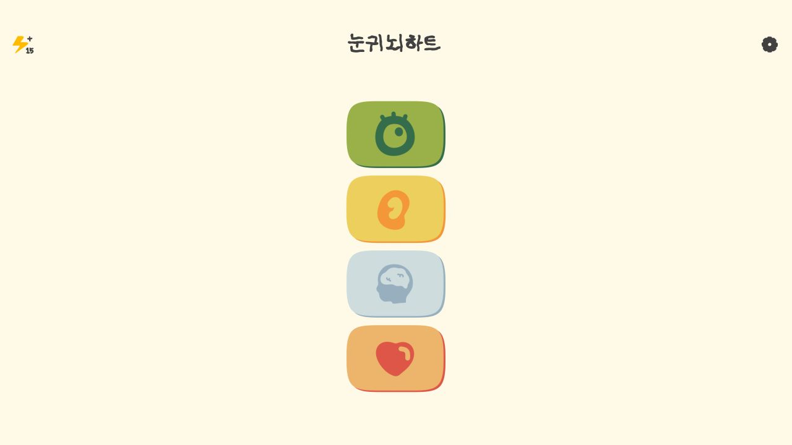

# 눈귀뇌하트 (EEBH)

> 눈, 귀, 뇌를 골고루 사용하는 미니게임과 플레이 기록을 담은 인지 훈련 웹 게임

[서비스 바로가기](https://mongkwon.github.io/EEBH2/)



## 프로젝트 소개

눈귀뇌하트는 시각, 청각, 기억, 순서 판단을 짧은 미니게임으로 연습할 수 있는 웹 게임입니다. 사용자는 눈 게임, 귀 게임, 뇌 게임 카테고리에서 총 9개의 게임을 플레이하고 점수와 월간 달성 기록을 확인할 수 있습니다.

Figma Make에서 만든 React 화면을 Vite 프로젝트로 정리했으며, 배경음악과 효과음, 음성 파일, 광고 영상은 정적 파일로 포함해 GitHub Pages에서 바로 실행됩니다.

## 핵심 기능

- 눈 게임, 귀 게임, 뇌 게임으로 나뉜 3개 훈련 카테고리
- 폭탄, 셔플, 숫자, 버블, 방향, 단어, 카드, 색칠, 순서 게임
- 게임별 1~3단계 점수 저장
- 오늘 플레이 기록과 월간 달성 도장
- 카테고리별 기록을 보여주는 레이더 차트
- 점수가 낮은 카테고리와 게임을 추천하는 버튼 강조 효과
- 에너지 시스템과 광고 영상 보상
- 배경음악, 효과음, 음성 안내, 볼륨 설정

## 게임 구성

| 카테고리 | 게임 |
| --- | --- |
| 눈 게임 | 폭탄 게임, 셔플 게임, 숫자 게임 |
| 귀 게임 | 버블 게임, 방향 게임, 단어 게임 |
| 뇌 게임 | 카드 게임, 색칠 게임, 순서 게임 |
| 게임 기록 | 전체 점수, 월간 달성 도장, 카테고리별 기록 |

게임 기록과 설정은 브라우저의 `localStorage`에 저장됩니다. 별도 회원가입이나 서버 없이 같은 기기와 브라우저에서 이어서 플레이할 수 있습니다.

## 실행 방법

```bash
npm install
npm run dev
```

## 빌드

```bash
npm run build
```

## 기술 스택

- Frontend: React, TypeScript, Vite
- UI: Tailwind CSS, Radix UI, MUI Icons
- Chart: Recharts
- Storage: localStorage
- Deployment: GitHub Actions, GitHub Pages
