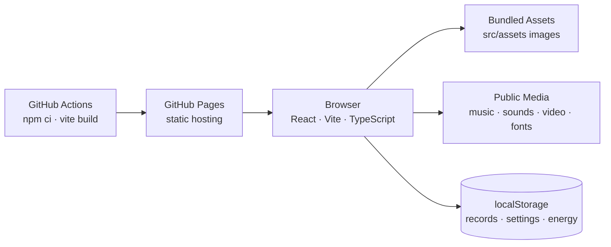

# 눈귀뇌하트 (EEBH)

> 눈, 귀, 뇌를 골고루 사용하는 미니게임과 매일의 플레이 기록을 담는 아동용 인지 훈련 게임

[서비스 바로가기](https://mongkwon.github.io/EEBH2/)

## 프로젝트 소개

눈귀뇌하트는 **시각, 청각, 기억, 순서 판단을 짧은 미니게임으로 반복 훈련하는 웹 게임**입니다. 사용자는 눈 게임, 귀 게임, 뇌 게임 카테고리에서 총 9개의 게임을 플레이하고, 카테고리별 점수와 월간 달성 기록을 확인할 수 있습니다.

앱은 Figma Make에서 생성한 React 코드를 Vite 프로젝트로 정리한 버전입니다. 이미지 에셋은 `src/assets`에서 번들링하고, 배경음악·효과음·광고 영상·폰트처럼 런타임 경로가 중요한 파일은 `public`에 둬서 GitHub Pages 배포 환경에서도 동일하게 불러옵니다.

## 핵심 기능

- 눈 게임, 귀 게임, 뇌 게임으로 나뉜 3개 훈련 카테고리
- 폭탄, 셔플, 숫자, 버블, 방향, 단어, 카드, 색칠, 순서 게임으로 구성된 9개 미니게임
- 카테고리와 게임별 1~3단계 점수 기록
- 점수가 낮은 카테고리와 게임을 자동 추천하는 버튼 강조 효과
- 일일 플레이 기록, 월간 달성 도장, 레이더 차트 기반 기록 화면
- 에너지 시스템과 광고 영상 시청 보상 흐름
- 배경음악, 효과음, 크레딧 음악, 게임별 전용 BGM
- 효과음과 배경음악 On/Off 및 볼륨 조절
- 귀 게임 진입 시 헤드폰 안내 오버레이
- 모바일 브라우저의 safe area를 고려한 고정 화면 UI

## 게임 구성

| 카테고리 | 게임 | 기록 키 |
| --- | --- | --- |
| 눈 게임 | 폭탄 게임, 셔플 게임, 숫자 게임 | `bombGame`, `yabawiGame`, `numberGame` |
| 귀 게임 | 버블 게임, 방향 게임, 단어 게임 | `bubbleShooter`, `directionGame`, `classifyGame` |
| 뇌 게임 | 카드 게임, 색칠 게임, 순서 게임 | `memoryGame`, `coloringGame`, `clickInOrder` |
| 게임 기록 | 월간 달성 도장, 카테고리별 기록, 전체 점수 | localStorage 기반 통계 |

게임 기록, 설정, 에너지 상태는 서버 없이 브라우저의 `localStorage`에 저장됩니다. 같은 기기와 같은 브라우저에서 이어서 플레이할 수 있지만, 브라우저 데이터를 삭제하면 기록도 함께 초기화됩니다.

## 아키텍처



브라우저 애플리케이션은 GitHub Pages에서 정적으로 호스팅됩니다. 별도 백엔드 없이 점수, 설정, 에너지, 일일 달성 여부를 브라우저 저장소에 기록하고, 음원과 영상은 `public` 경로의 정적 파일로 제공합니다.

## 주요 기술 결정

### Figma Make 코드의 Vite 정리

Figma Make에서 생성된 React 코드를 Vite 앱으로 실행할 수 있도록 의존성을 정리했습니다. `package@version` 형태의 import를 일반 패키지 import로 해석하는 Vite alias를 추가해 Figma Make 코드 번들 구조를 유지하면서 로컬 개발과 GitHub Actions 빌드가 가능하게 했습니다.

### 정적 미디어 경로 유지

배경음악, 효과음, 음성 파일, 광고 영상, 커스텀 폰트는 `public`에 둡니다. Vite가 `public` 파일을 그대로 복사하므로 `/music/main1.mp3`, `/video/ad1.mp4` 같은 경로를 개발 서버와 배포 서버에서 동일하게 사용할 수 있습니다.

### 브라우저 자동재생 정책 대응

브라우저는 사용자 제스처 전의 오디오 자동재생을 제한합니다. 앱은 시작 화면에서 먼저 음악 재생을 시도하고, 사용자가 `게임 시작`을 누르면 음소거 상태를 해제한 뒤 메인 배경음악을 다시 보장합니다. 같은 메인 음악 계열로 돌아올 때도 멈춘 오디오를 복구하도록 처리했습니다.

### 로컬 저장 중심 기록 관리

회원 인증이나 서버 데이터베이스 없이 사용할 수 있도록 점수, 도장, 설정, 에너지 값을 `localStorage`에 저장합니다. 배포 구조가 단순하고 개인정보를 서버로 보내지 않지만, 여러 기기 간 기록 동기화는 제공하지 않습니다.

### GitHub Pages 배포

저장소의 `main` 브랜치에 push하면 GitHub Actions가 `npm ci`와 `npm run build`를 실행하고, 생성된 `dist` 폴더를 GitHub Pages에 배포합니다. Vite `base`는 GitHub Pages의 프로젝트 하위 경로에서도 에셋이 깨지지 않도록 상대 경로로 설정했습니다.

## 기술 스택

- Frontend: React 18, TypeScript, Vite
- Styling/UI: Tailwind CSS, Radix UI, MUI Icons, lucide-react
- Animation: motion, CSS keyframes
- Audio/Video: HTML5 Audio, HTML5 Video
- Charts: Recharts
- Storage: browser localStorage
- Deployment: GitHub Actions, GitHub Pages

## 로컬 실행

```bash
npm install
npm run dev
```

개발 서버가 실행되면 Vite가 안내하는 로컬 주소로 접속합니다. 기본 포트는 보통 `http://127.0.0.1:5173/`입니다.

## 빌드

```bash
npm run build
```

빌드 결과는 `dist` 폴더에 생성됩니다. `dist`와 `node_modules`는 저장소에 커밋하지 않습니다.
